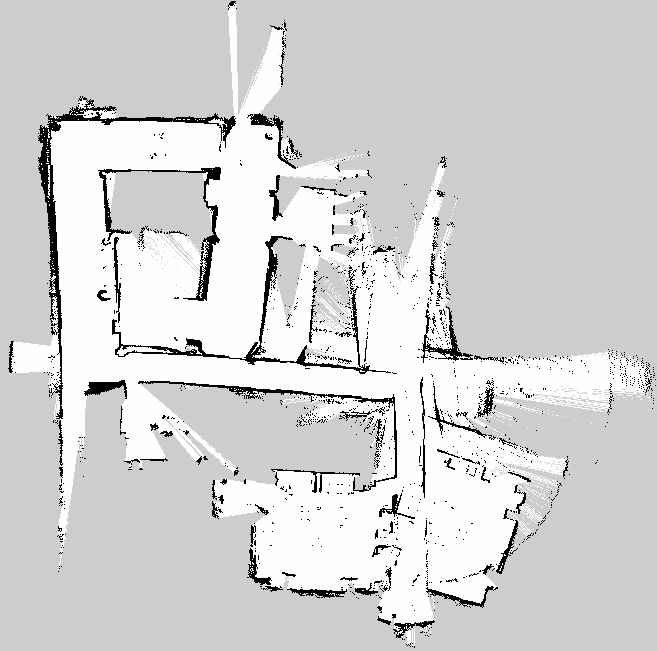
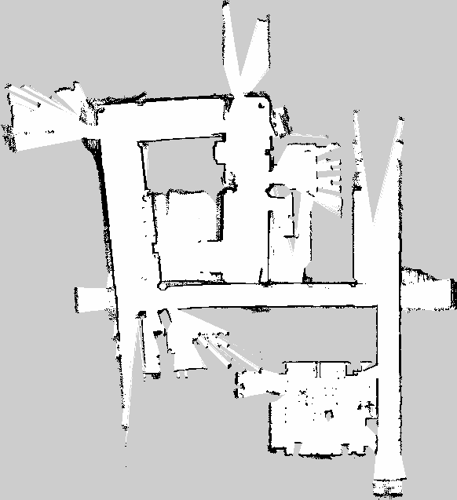
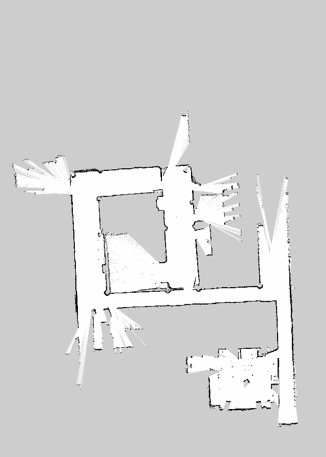

# Documentación de los algoritmos SLAM
# Pruebas en diferentes dispositivos

Primero se intenta hacer un mapa de la planta 2 del edificio 5C, partiendo de la sala multiusos. En este enlace se puede ver el [mapa](https://openmaps.upv.es/?locate=V.5C.2.040).

En la imagen se muestra el recorrido que hace el turtlebot para mapear parte de la planta.

Se hacen pruebas en tres escenarios diferentes:
- **Escenario 1:** El PC ejecuta el SLAM, la raspberry comunica las lecturas de los sensores al PC vía WiFi. ***Inconveniente***: La señal WiFi Se degrada a medida que se aleja el robot.

- **Escenario 2:** La Raspberry ejecuta el SLAM, el PC no interviene. ***Inconveniente***: Menos capacidad de procesamiento.
- **Escenario 3:** Se utiliza un portatil para que ejecute el SLAM, apoyado en la base del turtlebot. ***Inconveniente***: Se añade un peso extra al robot y no es estable.
  
### Escenario 1
El resultado no es el esperado, ya que cuando pierde la señal wifi deja de mapear y se desincroniza con el PC.

### Escenario 2

### Escenario 3

Finalemte se va a utilizar el escenario 3 para probar todos los algoritmos. 
Para que el resultado de cada algoritmo sea el más imparcial y constante posible se graba la trayectoria descrita anteriormente mediante un archivo bag. Se graban los topics siguietes:
- /scan
- /odom
- /imu
- /tf
- /tf_static

Para el slam visual se graba otra trayectoria incluyendo los topics de la cámara rgbd.

# SLAM 2D
## slam_toolbox

Se ha utilizado el paquete SLAM por defecto: [slam_toolbox](https://github.com/SteveMacenski/slam_toolbox), el cual utiliza SLAM basado en un  [problema de optimización de posición en grafos](https://github.com/ceres-solver/ceres-solver/blob/master/examples/slam/pose_graph_2d/README.md) o en inglés *pose graph optimization problem*.

Para resolver el problema de optimización utiliza un pluguin de Google llamado [Ceres](https://github.com/ceres-solver/ceres-solver).

Este es el mapa que se ha generado tras pasear el Turtlebot por la sala:

Se utiliza el mando para controlar el robot utilizando el modo de velocidad normal (sin turbo) que por defecto está a 0.2 m/s en linear y a 0.5 rad/s. Mientras que el turbo funciona a 0.5 m/s y a 1.9 rad/s.

Se ha tomado otra muestra, esta vez saliendo al pasillo de al lado del despacho:

Finalmente se crea el mapa según el archivo bag grabado y el resultado es el siguiente:

## gmapping

Se ha probado el clásico algoritmo gmapping:

## HectoSLAM

## cartographer

