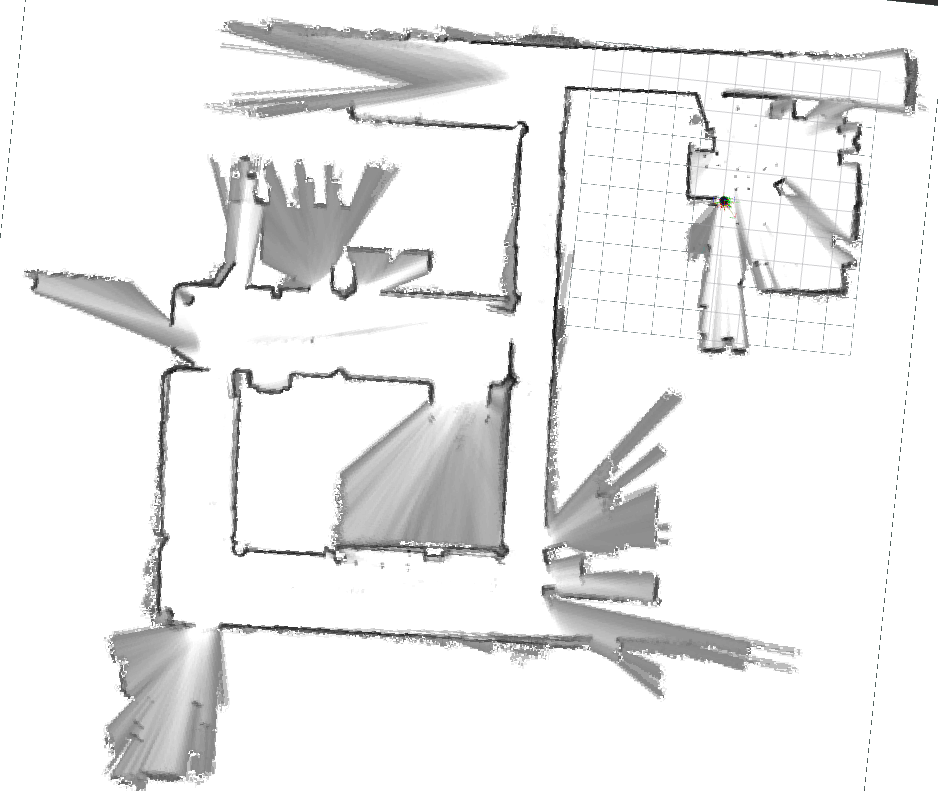

# Analisis de calidad de los mapas.

Se aplicarán los métodos sugeridos en el estudio [2D SLAM Quality Evaluation Methods](https://arxiv.org/pdf/1708.02354.pdf). 
Estos métodos resultan útiles si no se dispone de un mapa de referencia en el mismo formato que los mapas binarios obtenidos 
con los algoritmos SLAM. Las métricas son las siguientes:

- Proporción de píxeles ocupados.
- Número de esquinas.
- Numero de áreas encerradas.

Las métricas se representarán en un boxplot, ya que los algoritmos tienen carácter probabilístico, por lo que se realizan 50 iteraciones para cada uno. Aun así, los resultados no presentan apenas variabilidad.

Todos los algoritmos excepto cartographer publican un occupacy grid con un threshold aplicado, teniendo el mapa solamente tres valores: ocupado, libre o desconocido. Excepto cartographer, que 
nos dice la probabilidad de cada celda de estar ocupada. Para obtener el mapa ya discretizado se ha utilizado como threshold la 
media de todos los valores de las celdas que no son desconocidas (!= -1).

- El aspecto antes de aplicar el threshold:

- Tras aplicar el threshold:
  

## Proporción de píxeles ocupados

Esto es una métrica de calidad, donde puede indicar si el algoritmo ha dibujado la misma pared u objeto dos veces de manera que se repite y aumenta el espacio ocupado de manera artificial. Puede ser engañoso ya que *slam_toolbox* utiliza puntos de mayor tamaño para definir un espacio ocupado, por lo que su proporción será mayor al resto aunque no tenga errores de precisión. 

La proporción se calcula dividiendo el número de píxeles que se consideran ocupados entre el número de píxeles que se consideran espacio libre o desconocido.

El resultado se muestra en la figura. 

## Número de áreas encerradas

Un área cerrada es una región en el mapa que está completamente rodeada por celdas cuyas probabilidades de estar ocupadas son mucho más altas o desconocidas. Estas celdas que rodean el área cerrada se pueden pensar como las paredes que rodean un espacio abierto.

La presencia de tales áreas cerradas indica un fallo en varias situaciones. Por ejemplo, cuando una habitación es escaneada varias veces pero no es reconocida, el mapa final estará compuesto por pequeñas rotaciones de la habitación superpuestas entre sí, lo que resultará en múltiples triángulos cerrados en los bordes exteriores de la región explorada. Otra posibilidad de fallo es el cierre de bucle, cuando un robot no logra reconocer que ha regresado al mismo lugar donde comenzó. En ese caso, se puede observar una superposición entre las partes inicial y final del mapa construido.

Las áreas cerradas se encuentran utilizando el algoritmo de Suzuki, diponible en la librería opencv.

## Número de esquinas

También se cree que, con la misma secuencia, cuantas más esquinas tiene el mapa estimado, mayor es la probabilidad de que este mapa sea menos consistente y tenga más artefactos. Siempre y cuando ningún algoritmo pierda o elimine información, y las esquinas reales se reflejen correctamente en cada mapa, cualquier esquina adicional sería un error: artefactos, paredes duplicadas causadas por desajuste en la trayectoria y áreas de círculos rotos. Es cierto que diferentes niveles de detalle entre diferentes algoritmos SLAM pueden hacer que esta comparación sea menos convincente, pero al aplicar una regla más estricta para definir qué es una "esquina", esta métrica podría indicar con éxito la consistencia con una probabilidad razonable empíricamente.

Para este propósito específico, solo se tienen en cuenta las esquinas estructurales, ignorando pequeños puntos dispersos en el área libre. Estos puntos podrían ser pequeños obstáculos o simplemente ruido, y al ignorarlos se obtiene un resultado más claro y preciso.

Para extraer las esquinas de los mapas en bruto se aplica un filtro Gaussiano-Laplaciano para extraer la estructura abstracta del nuevo mapa. Basándose en la estructura abstracta, después de eliminar pequeños puntos discretos, se aplica el detector de esquinas de Harris en la estructura del mapa preprocesado para obtener las esquinas estructurales del mapa. Todos los métodos se aplican con funciones de la librería opencv.

|                   | Occupacy proportion | Enclosed areas | Number of corners |
| :--------:        | :--------: | :---------: | :-------: | 
| **cartographer**  ||||
| **slam_toolbox**  ||||
| **hector**        ||||
| **gmapping**      ||||

