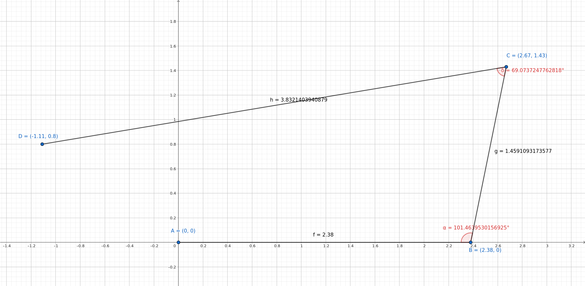

# Análisis de trayectorias

## Medición de los segmentos
Se conduce el robot formando una trayectoria compuesta por 4 puntos, en cada punto se gira el robot y se conduce en línea recta hasta el siguiente punto. 
Se miden los segmentos que unen parejas de puntos consecutivos. 

Las medidas en **metros** de los segmentos son:

- r1: 2.38
- r2: 1.46
- r3: 3.83

Primero deberemos obtener las coordenadas cartesianas de los 4 puntos y así poder represetar gráficamente la trayectoria y compararla con las trayectorias calculadas por los algoritmos SLAM. Para ello 
necesitamos calcular los ángulos de cada giro, para poder hacer esto se descompone la trayectoria en dos triángulos, para cada uno se mide la "hipotenusa", es decir la recta restante, que se consigue midiendo 
la distancia entre dos puntos no consecutivos.

## Cálculo de los ángulos de giro

Por lo tanto tendremos 2 triángulos, T1 y T2.

T1 está compuesto por los lados:
- a1=r1=2.38m 
- b1=r2=1.46m
- c1=h1=3.83m

Necesitamos saber el ángulo de giro entre las rectas r1 y r2, lo llamaremos C1, ya que es el ángulo opuesto a c1. Se calcula con la ley del coseno:

cos(C1) = (a^2 + b^2 - c^2) / 2ab

Despejamos C1: 

C1 = arccos[(a^2 + b^2 - c^2) / 2ab]

**C1 = &alpha; = 101.5º**. 

T2 está compuesto por los lados:
- a2=r2=1.46m
- b2=r3=3.83m
- c2=h2=3.58m

De la misma manera, aplicando la ley del coseno obtenemos C2, que es el ángulo que nos interesa. **C2 = &beta; = 69.13°**

## Cálculo de las coordenadas cartesianas

Por lo tanto tenemos una trayectoria con 4 puntos, sabemos la longitud de los tres segmentos y sabemos sus dos ángulos de giro, si suponemos que el punto inicial es A=(0,0) y que el desplazamiento al siguiente punto se 
realiza siguiendo el eje X, por lo que será B=(2.38,0), podremos calcular las coordenadas de los puntos restantes C y D.

Para calcular las coordenadas de C usaremos la fórmula *x = xB + d * cos(θ)*  y *y = yB + d * sen(θ),* donde (xB, yB) son las coordenadas del punto B,
d es la distancia entre los puntos B y C y θ es el ángulo que forman las rectas AB y BC con respecto al eje x. En este caso, tenemos que θ = 101.5°.

Esto nos da las coordenadas C=(2.67, 143).

De la misma manera calculamos D teniendo como referencia (xC, yC), el resultado es D=(-1.11, 0.8).

## Representación gráfica de la trayectoria

Finalmente tenemos los 4 puntos calculados:

- A=(0,0)
- B=(2.38,0)
- C=(2.67, 143)
- D=(-1.11, 0.8)
  
Representamos los segmentos en [Geogebra](https://www.geogebra.org):

Observamos que los valores calculados son aproximados, pero lo suficientemente precisos como para tomarlos como referencia.
