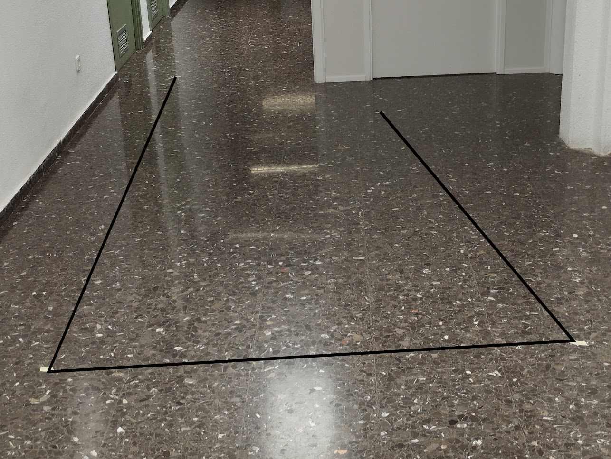

# Análisis de trayectorias

Se pretende evaluar la calidad de la localización de varios algoritmos SLAM utilizando una trayectoria marcada como referencia y comparándola con la trayectoria obtenida por cada algoritmo, de la misma manera que se hace en este paper https://ieeexplore.ieee.org/stamp/stamp.jsp?tp=&arnumber=8250081 

Los algoritmos disponibles y funcionales en ROS2 son los siguientes:
- cartographer
- slam_toolbox
- hector
- gmapping
- rtabmap (SLAM Visual)

Todos son SLAM 2D, los cuales utilizan el láser como sensor principal para la localización y mapeo, exceptuando rtabmap, el cual utiliza la cámara estereoscópica del turtlebot.

Se han intentado probar otros algoritmos de SLAM Visual (ORB-SLAM2 y 3, VinsFusion) sin éxito, debido a problemas de incompatibilidad con la nueva versión de ROS y a su falta de mantenimiento por parte de los desarrolladores.

# Obtención de la trayectoria real
## Conducción del robot 
Se conduce el robot en un espacio no muy extenso en lineas rectas y giros en 4 puntos del espacio. Cuando se va a girar primero se marca en el suelo la posición del robot. Luego se miden las distancias entre los cuatro puntos, el inicial, dos giros y el final.

Tras conducir el robot queda la trayectoria siguiente (representación no exacta de la trayectoria realizada):

## Medición de los segmentos
Se conduce el robot formando una trayectoria compuesta por 4 puntos, en cada punto se gira el robot y se conduce en línea recta hasta el siguiente punto. 
Se miden los segmentos que unen parejas de puntos consecutivos. 

Las medidas en **metros** de los segmentos son:

- r1: 2.38
- r2: 1.46
- r3: 3.83

Primero deberemos obtener las coordenadas cartesianas de los 4 puntos y así poder represetar gráficamente la trayectoria y compararla con las trayectorias calculadas por los algoritmos SLAM. Para ello 
necesitamos calcular los ángulos de cada giro, para poder hacer esto se descompone la trayectoria en dos triángulos, para cada uno se mide la "hipotenusa", es decir la recta restante, que se consigue midiendo 
la distancia entre dos puntos no consecutivos.

## Cálculo de los ángulos de giro

Por lo tanto tendremos 2 triángulos, T1 y T2.

T1 está compuesto por los lados:
- a1=r1=2.38m 
- b1=r2=1.46m
- c1=h1=3.83m

Necesitamos saber el ángulo de giro entre las rectas r1 y r2, lo llamaremos C1, ya que es el ángulo opuesto a c1. Se calcula con la ley del coseno:

cos(C1) = (a^2 + b^2 - c^2) / 2ab

Despejamos C1: 

C1 = arccos[(a^2 + b^2 - c^2) / 2ab]

**C1 = &alpha; = 101.5º**. 

T2 está compuesto por los lados:
- a2=r2=1.46m
- b2=r3=3.83m
- c2=h2=3.58m

De la misma manera, aplicando la ley del coseno obtenemos C2, que es el ángulo que nos interesa. **C2 = &beta; = 69.13°**

## Cálculo de las coordenadas cartesianas

Por lo tanto tenemos una trayectoria con 4 puntos, sabemos la longitud de los tres segmentos y sabemos sus dos ángulos de giro, si suponemos que el punto inicial es A=(0,0) y que el desplazamiento al siguiente punto se 
realiza siguiendo el eje X, por lo que será B=(2.38,0), podremos calcular las coordenadas de los puntos restantes C y D.

Para calcular las coordenadas de C usaremos la fórmula *x = xB + d * cos(θ)*  y *y = yB + d * sen(θ),* donde (xB, yB) son las coordenadas del punto B,
d es la distancia entre los puntos B y C y θ es el ángulo que forman las rectas AB y BC con respecto al eje x. En este caso, tenemos que θ = 101.5°.

Esto nos da las coordenadas C=(2.67, 143).

De la misma manera calculamos D teniendo como referencia (xC, yC), el resultado es D=(-1.11, 0.8).

## Representación gráfica de la trayectoria

Finalmente tenemos los 4 puntos calculados:

- A=(0,0)
- B=(2.38,0)
- C=(2.67, 143)
- D=(-1.11, 0.8)
  
Representamos los segmentos en [Geogebra](https://www.geogebra.org):

Observamos que los valores calculados son aproximados, pero lo suficientemente precisos como para tomarlos como referencia.

# Obtención de las trayectorias calculadas

Cada algoritmo obtiene una estimación de la localización del robot en base a diferentes entradas de los sensores. El problema es que cada uno muestra la posición tomando como referencia frames diferentes, a parte de esto tampoco son consistentes entre si en el formato de mensaje en el que se publica la posición en cada instante. 

## Obtención de las posiciones

El objetivo es obtener un archivo csv para cada algoritmo con dos columnas: x e y. Cada fila registra un punto diferente.

El primer método para obtener la lista de puntos que forman la trayectoria calculada por cada algoritmo es obtener los componentes de posición x e y de la transformación entre el *frame* "map" y el *frame* "base_link", esto es algo que ROS2 nos permite hacer con facilidad, programando un nodo que escuche el *topic* `/tf` y obtenga las posiciones. 

El problema surge cuando los *frames* tienen una diferencia en sus marcas de tiempo muy grande, por lo que ROS2 no nos deja calcular la posición directamente. Esta diferencia de tiempo viene debido a que el algoritmo se ejecuta a partir de un archivo *rosbag* que publica los topics con la marca de tiempo de cuando se grabó en su momento, mientras que el algoritmo publica el *frame* "map" con la marca de tiempo equivalente al momento en que se está ejecutando. Este inconveniente surge en los algoritmos cartographer, gmapping y rtabmap.

Para estos casos especiales se han utilizado otros métodos para obtener las posiciones:

- rtabmap: el nodo publicaba un topic del tipo geometry_msgs/msg/PoseWithCovarianceStamped, lo cual solo hay que programar un nodo que escuche en dicho topic y se guarde las coordenadas x e y de cada posición.
- cartographer: este nodo publicaba un topic de tipo visualization_msgs/msg/MarkerArray, con un array de posiciones que va aumentando conforme se registran nuevas. Se programa un nodo que escucha en este topic y se guarda el último elemento del array, el cual contiene todas las posiciones, desde las más antiguas hasta las más recientes.
- gmapping: No publica ningún topic, pero imprime por pantalla las posiciones que va registrando, por lo que solamente se redirecciona la salida estandar de nodo a un archivo. Posteriormente se le da formato csv a este archivo.

## Transformación de los puntos a un sistema de coordenadas común

