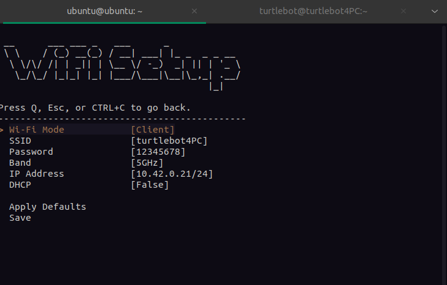
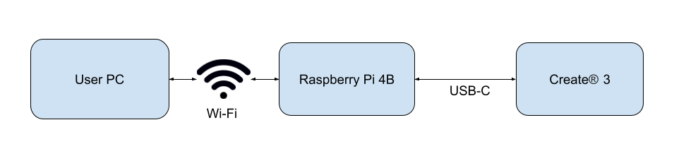

# conexión turtlebot - PC
## Adaptador wifi PC TP-Link Archer T3U Plus

Instalación de drivers y puesta en marcha:
```Bash
sudo apt update
sudo apt install git linux-headers-generic dkms dwarves
cp /sys/kernel/btf/vmlinux /usr/lib/modules/`uname -r`/build/
git clone https://github.com/RinCat/RTL88x2BU-Linux-Driver
cd RTL88x2BU-Linux-Driver
sudo make uninstall
make clean
make
sudo make install
sudo modprobe 88x2bu
sudo reboot
```

Comprobar que aparece el nuevo adaptador con `ip a`

Si tras hacer el paso anterior y después de actualizar deja de detectarse el adaptador, tendremos que ejecutar los siguientes comandos:
```
cd RTL88x2BU-Linux-Driver
sudo make install
sudo modprobe 88x2bu
```
Y debería volver a aparecer el adaptador en `ip a`.

### Activar AP Hotspot 
Activar modo AP en el adaptador WiFi:
```Bash
nmcli d wifi hotspot ifname wlx30de4be0df50 ssid turtlebot4PC band a password 12345678 channel 44
```

### Diagnóstico de erorres del adaptador wifi

Para ver todos los mensajes relacionados con el adaptador wifi es recomendable usar el comando:
```
journalctl  -f -u wpa_supplicant -u NetworkManager -u systemd-networkd
```
Y así depuraremos los errores con más facilidad.

### Habilitar redireccionamiento NAT

Añadir una regla iptables para habilitar el tráfico a modo de router NAT:

```Bash
sudo iptables -t nat -s 10.42.0.0/24 -A POSTROUTING -j MASQUERADE
```

Guardar la regla de manera persistente:

```Bash
sudo su
apt install iptables-persistent
iptables-save > /etc/iptables/rules.v4
```

## Conexión turtlebot al AP

Mediante conexión Ethernet, configurar el PC para que tenga IP estática:
1. IP: 192.168.185.5
2. mask: 255.255.255.0
3. gateway: 192.168.185.1

Conectarse mediante ssh al turtlebot `ubuntu@192.168.185.3` (contraseña: turtlebot4) e introducir el comando para configurar la conexión wifi: `turtlebot4-setup`

Una vez dentro seleccionar Wi-Fi Setup con la siguiente configuración:



Despues guardar y aplicar cambios, se reiniciará y ya tendrá IP.


**A partir de este momento desconectaremos el cable ethernet de la RP y nos conectaremos a ella a traves de ssh por la interfaz wifi**

## Activar Discovery-Server

Al usar ROS2 Humble es recomendable activar el discovery-server para que solamente se conecte la Raspberry al AP, y que el Create 3 actúe como un cliente local. De esta manera nos ahorramos problemas con el multicasting. 



Para activar el Discovery-Server se siguen las instrucciones del [manual de usuario](https://turtlebot.github.io/turtlebot4-user-manual/setup/discovery_server.html).

Al final de todos los pasos deberemos poder ver todos los topics de la raspberry y del Create 3 desde el PC.


## Configurar chrony en el PC

En nuestro PC editar el archivo `/etc/chrony/chrony.conf` y añadir lo siguiente:

```Bash
# cnfig ntp sync with turtlebot
server 10.42.0.21 presend 0 minpoll 0 maxpoll 0 iburst  prefer trust
# enable serving time to ntp clients on 10.42.0.0 subnet
allow 10.42.0.0/24
# serve time even offline
local stratum 10
```

Tendremos que abrir el puerto 123 en el protocolo UDP para aceptar peticiones NTP:

```Bash
sudo ufw allow from any to any port 123 proto udp
```

Y en la **Raspberry** editar `/etc/chrony/chrony.conf` y añadir: 

```Bash
server 10.42.0.1 iburst prefer
```

Y reiniciar chrony `sudo systemctl restart chronyd`.

De esta forma el PC actuará como servidor NTP. Antes de proseguir comprobaremos con el comando `date` que se muestra la misma fecha y hora que en el PC. Puede que debamos ejecutar varias veces el comando `date`.


## Configurar DNS y gateway para acceso a internet en la RP

Para tener acceso a internet deberemos editar el archivo `/etc/netplan/50-wifis.yaml` para que tenga el siguiente aspecto:

```Yaml
network:
    version: 2
    wifis:
        renderer: NetworkManager
        wlan0:
            access-points:
                turtlebot4PC:
                    band: 5GHz
                    password: '12345678'
            addresses:
            - 10.42.0.21/24
            routes:
              - to: default
                via: 10.42.0.1
            dhcp4: false
            optional: true
```

Guardamos la configuración ejecutando `sudo netplan apply`. Con esto usaremos la dirección 10.42.0.1 como gateway de todo nuestro tráfico.

Comprobamos que tenemos acceso a internet:

```
ping 8.8.8.8
```

Falta añadir los servidores DNS editando el fichero `/etc/resolv.conf` y añadiendo el PC como servidor DNS:

```Bash
nameserver 10.42.0.1
```

Ahora instalaremos un paquete para poder aplicar la configuración del DNS de forma permanente:

```Bash
sudo apt update; sudo apt install resolvconf -y
sudo systemctl enable resolvconf.service
sudo systemctl start resolvconf.service
```

Añadiremos la siguiente linea a `/etc/resolvconf/resolv.conf.d/head`: 

```Bash
nameserver 10.42.0.1
```

Reiniciamos y aplicamos los cambios: 

```Bash
sudo resolvconf --enable-updates
sudo resolvconf -u
sudo systemctl restart resolvconf.service
sudo systemctl restart systemd-resolved.service
```

Ahora podremos actualizar todo el sistema, taradará un buen rato, así que debemos tener paciencia:

```
sudo apt upgrade -y;
```

## Configuración extra

### Cambiar hostname y color prompt
Para tener una distinción clara cuando se esté conectado a la raspberry se propone cambiar el color del bash prompt y el nombre del host.

Primero editaremos el archivo `/etc/hostname` y cambiaremos el nombre por `raspberry`.

Despues iremos al archivo `~/.bashrc` y descomentaremos la línea que dice `force_color_prompt=yes`. También en la linea que tiene el siguiente aspecto:

```Bash
    PS1='${debian_chroot:+($debian_chroot)}\[\033[01;32m\]\u@\h\[\033[00m\]:\[\033[01;34m\]\w\[\033[00m\]\$ '
```

Cambiaremos el color verde `[01;32m]` por el color rojo `[0;31m]` justo antes de donde pone `\u@\h`.

Aplicaremos los cambios completamente reiniciando la raspberry.

### Deshabilitar el nodo DIAGNOSTICS

Para que el lidar no esté girando en todo momento, y solo cuando hay un nodo suscrito a su topic `/scan` se recomienda deshabilitar el nodo turtlebot_diganostics siempre y cuando no vayamos a necesitarlo.

Para ello editaremos el archivo `/etc/turtlebot4/setup.bash` y cambiaremos la variable de entorno `TURTLEBOT4_DIAGNOSTICS` a 0.

### Crear copia de seguridad del sistema 
En el caso de que hayamos completado toda la configuración y funcione todo correctamente, se recomienda crear una imagen a modo de copia de seguridad.

En el PC ejecutaremos el siguiente comando: 

```Bash
ssh ubuntu@10.42.0.21 'sudo dd if=/dev/mmcblk0 bs=4M' > ~/backup_rp_img.img
```

Guardaremos la imagen para disponer de ella en un futuro si hiciera falta.

## ERRORES 
### ERROR DE SINCRONIZACIÓN

El Create 3 tiene configurada la zona horaria en UTC, mientra que la zona horaria en Valencia es CEST (UTC +2), por lo que está 2 horas con retraso. De momento no se consigue configurar para que vaya correctamente.

#### SOLUCIÓN PROVISIONAL

Como por el momento no se ha conseguido cambiar la zona horaria del Create 3 para que esté sincronizado con el PC y la Raspberry, lo que se propone es cambiar la zona horaria tanto en el PC como en la Raspberry a Greenwich Mean Time (GMT). De la siguiente manera:

```Bash
timedatectl set-timezone GMT
```

Esto es una solución provisional, ya que lo ideal es que estemos usando la hora correcta en todos los ordenadores, y no acoplarnos a la hora incorrecta. 
Pese a esto, no soluciona los mensajes de error y el problema de sincronización sigue presente.
