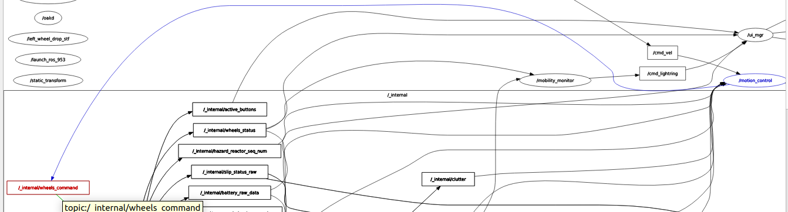

# Documentación de cada tarea relacionada con ROS2

## Lectura de las velocidades y voltajes de las ruedas

Se encuentran los siguientes topics relacionados con información sobre las ruedas:

1. `/wheel_status` de tipo `irobot_create_msgs/msg/WheelStatus`
2. `/wheel_ticks` de tipo `irobot_create_msgs/msg/WheelTicks`
3. `/wheel_vels` de tipo `irobot_create_msgs/msg/WheelVels`

El topic `/wheel_status` nos otorga información sobre la intensidad de corriente de cada rueda y el PWM (porcentaje de tiempo en el que se envía corriente a la rueda).

Para obtener las velocidades de las ruedas se utilizará `/wheel_vels` y para los ticks del encoder `/wheel_ticks`.

## Escritura de las velocidades y voltajes de las ruedas

Por el momento no hay ningún topic disponible para darle velocidades a las ruedas.

En la siguiente imagen se puede ver que el nodo `/motion_control` publica en un topic interno llamado `/_internal/wheels_command`. Podría ser interesante modificar el nodo `/motion_control` para que ofreciera un topic en el que publicar las velocidades de las ruedas y que este se lo pasara al topic interno. 

