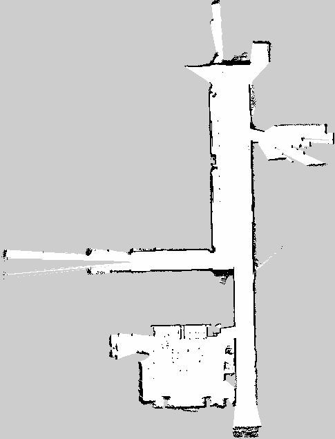

# Documentación de cada tarea relacionada con ROS2

## Prueba de SLAM por defecto

Se ha iniciado el SLAM que viene por defecto en el turtlebot 4. 

Parece que hay un problema en la visualización del lidar en rviz mientras se realiza el SLAM. Parece que no puede realizar la transformada entre el frame `map` y el frame `rplidar_link`:

```
[rviz2-1] [ERROR] [1683196573.628807857] [rviz2]: Lookup would require extrapolation into the future.  Requested time 1677796205,300857 but the latest data is at time 1677796205,209008, when looking up transform from frame [rplidar_link] to frame [map]
```

Esto no da problemas a la hora de crear el mapa, ya que parece que el SLAM funciona correctamente y lee los datos del laser bien. 

Este es el mapa que se ha generado tras pasear el Turtlebot por la sala:


Se utiliza el mando para controlar el robot utilizando el modo de velocidad normal (sin turbo) que por defecto está a 0.2 m/s en linear y a 0.5 rad/s. Mientras que el turbo funciona a 0.5 m/s y a 1.9 rad/s.

Se ha tomado otra muestra, esta vez saliendo al pasillo de al lado del despacho:




## Lectura de las velocidades y voltajes de las ruedas

Se encuentran los siguientes topics relacionados con información sobre las ruedas:

1. `/wheel_status` de tipo `irobot_create_msgs/msg/WheelStatus`
2. `/wheel_ticks` de tipo `irobot_create_msgs/msg/WheelTicks`
3. `/wheel_vels` de tipo `irobot_create_msgs/msg/WheelVels`


El topic `/wheel_status` nos otorga información sobre la intensidad de corriente de cada rueda y el PWM (porcentaje de tiempo en el que se envía corriente a la rueda).

Para obtener las velocidades de las ruedas se utilizará `/wheel_vels` y para los ticks del encoder `/wheel_ticks`.

## Escritura de las velocidades y voltajes de las ruedas

Por el momento no hay ningún topic disponible para darle velocidades a las ruedas.

En la siguiente imagen se puede ver que el nodo `/motion_control` publica en un topic interno llamado `/_internal/wheels_command`. Podría ser interesante modificar el nodo `/motion_control` para que ofreciera un topic en el que publicar las velocidades de las ruedas y que este se lo pasara al topic interno. 

