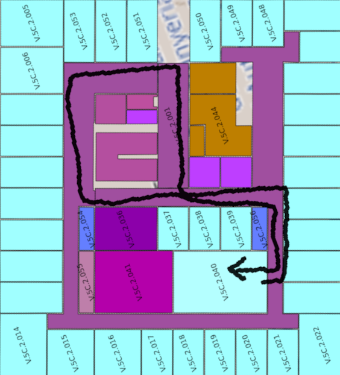
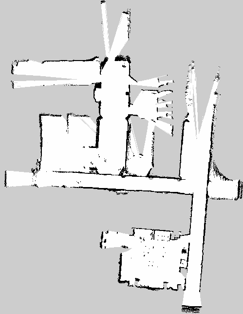

# Documentación de cada tarea relacionada con ROS2

## slam_toolbox

Se ha utilizado el paquete SLAM por defecto: [slam_toolbox](https://github.com/SteveMacenski/slam_toolbox), el cual utiliza SLAM basado en un  [problema de optimización de posición en grafos](https://github.com/ceres-solver/ceres-solver/blob/master/examples/slam/pose_graph_2d/README.md) o en inglés *pose graph optimization problem*.

Para resolver el problema de optimización utiliza un pluguin de Google llamado [Ceres](https://github.com/ceres-solver/ceres-solver).

Este es el mapa que se ha generado tras pasear el Turtlebot por la sala:


Se utiliza el mando para controlar el robot utilizando el modo de velocidad normal (sin turbo) que por defecto está a 0.2 m/s en linear y a 0.5 rad/s. Mientras que el turbo funciona a 0.5 m/s y a 1.9 rad/s.

Se ha tomado otra muestra, esta vez saliendo al pasillo de al lado del despacho:


## Pruebas en diferentes dispositivos

Primero se intenta hacer un mapa de la planta 2 del edificio 5C, partiendo de la sala multiusos. En este enlace se puede ver el [mapa](https://openmaps.upv.es/?locate=V.5C.2.040).



En la imagen se muestra el recorrido que hace el turtlebot para mapear parte de la planta.

Se hacen pruebas en tres escenarios diferentes:
- **Escenario 1:** El PC ejecuta el SLAM, la raspberry comunica las lecturas de los sensores al PC vía WiFi. ***Inconveniente***: La señal WiFi Se degrada a medida que se aleja el robot.

- **Escenario 2:** La Raspberry ejecuta el SLAM, el PC no interviene. ***Inconveniente***: Menos capacidad de procesamiento.
- **Escenario 3:** Se utiliza un portatil para que ejecute el SLAM, apoyado en la base del turtlebot. ***Inconveniente***: Se añade un peso extra al robot y no es estable.
  
### Escenario 1
El resultado no es el esperado, ya que cuando pierde la señal wifi deja de mapear y se desincroniza con el PC.



### Escenario 2


### Escenario 3


## Habilitar Stereo Depth 

Para utilizar visual SLAM la cámara deberá publicar la imágen de profundidad. Se consigue modificando el archivo de configuración `/opt/ros/humble/share/turtlebot4_bringup/config/oakd_pro.yaml`, el contendio de este archivo de configuración se encuentra en el siguiente [enlace](../config/oakd/oakd_pro.yaml).

## Error en la visualización del laser en RViz

Parece que hay un problema en la visualización del lidar en rviz mientras se realiza el SLAM. Parece que no puede realizar la transformada entre el frame `map` y el frame `rplidar_link`:

```
[rviz2-1] [ERROR] [1683196573.628807857] [rviz2]: Lookup would require extrapolation into the future.  Requested time 1677796205,300857 but the latest data is at time 1677796205,209008, when looking up transform from frame [rplidar_link] to frame [map]
```

Esto no da problemas a la hora de crear el mapa, ya que parece que el SLAM funciona correctamente y lee los datos del laser bien. 

## Lectura de las velocidades y voltajes de las ruedas

Se encuentran los siguientes topics relacionados con información sobre las ruedas:

1. `/wheel_status` de tipo `irobot_create_msgs/msg/WheelStatus`
2. `/wheel_ticks` de tipo `irobot_create_msgs/msg/WheelTicks`
3. `/wheel_vels` de tipo `irobot_create_msgs/msg/WheelVels`


El topic `/wheel_status` nos otorga información sobre la intensidad de corriente de cada rueda y el PWM (porcentaje de tiempo en el que se envía corriente a la rueda).

Para obtener las velocidades de las ruedas se utilizará `/wheel_vels` y para los ticks del encoder `/wheel_ticks`.

## Escritura de las velocidades y voltajes de las ruedas

Por el momento no hay ningún topic disponible para darle velocidades a las ruedas.

En la siguiente imagen se puede ver que el nodo `/motion_control` publica en un topic interno llamado `/_internal/wheels_command`. Podría ser interesante modificar el nodo `/motion_control` para que ofreciera un topic en el que publicar las velocidades de las ruedas y que este se lo pasara al topic interno. 

